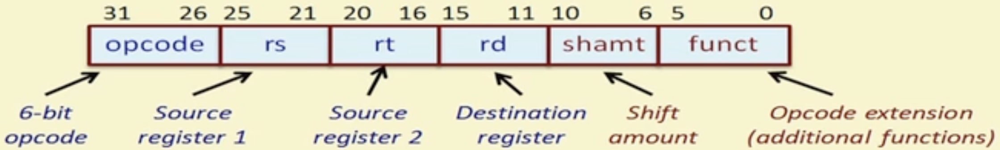
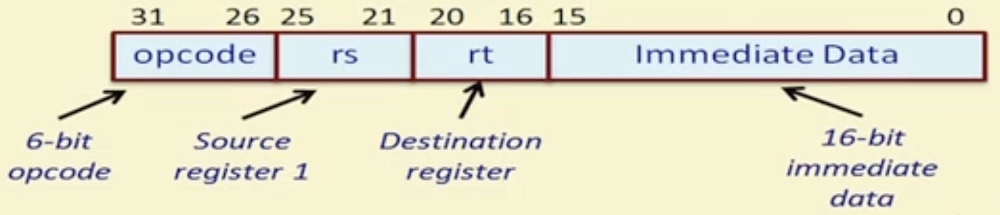
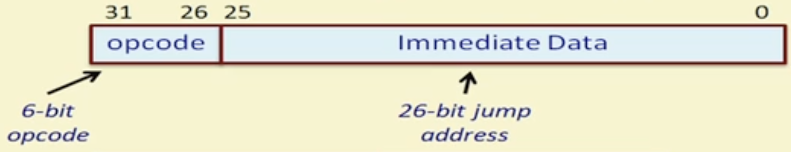

#  Week 8 Implementation of a Pipelined Processor

We will implement a MIPS32 (RISC) processor. It is a 32-bit processor that can operate on 32-bit data.

Features:

* 32 $\times$ 32-bit general purpose registers going from R0 to R32
    * Register R0 stores the value 0 and is read-only (cannot be written to)
* It has no flag registers (like zero, sign, carry, etc.)
* The memory word size is 32-bits (word addressable)

## MIPS32 Instructions

All instructions can be classified into R-type (Register), I-type (Immediate), and J-type (Jump) instructions.

All instructions are 32-bits with several fields.

Some instruction types may not use all fields.

### R-type Instructions



| Instruction | Opcode | Example | Meaning |
| --- | --- | --- | --- |
| ADD | 000000 | ADD R1, R2, R3 | R1 = R2 + R3 |
| SUB | 000001 | SUB R12, R10, R8 | R12 = R10 - R8 |
| AND | 000010 | AND R20, R1, R5 | R20 = R1 & R5 |
| OR  | 000011 | OR R11, R5, R6 | R11 = R5 \| R6 |
| SLT | 000100 | SLT R5, R11, R12 | If R11 < R12, R5 = 1; else R5 = 0 |
| MUL | 000101 | MUL R5, R6, R7 | R5 = R6 $\times$ R7 |
| HLT | 111111 | HLT | Halt execution of the program |

### I-type Instructions



| Instruction | Opcode | Example | Meaning |
| --- | --- | --- | --- |
| LW    | 001000 | LW R2, 124(R8) | R2 = Mem[R8 + 124] |
| SW    | 001001 | SW R5, -10(R25) | Mem[R25 - 10] = R5 |
| ADDI  | 001010 | ADDI R1, R2, 25 | R1 = R2 + 25 |
| SUBI  | 001011 | SUBI R5, R1, 150 | R5 = R1 - 150 |
| SLTI  | 001100 | SLTI R2, R10, 10 | If R10 < 10, R2 = 1; else R2 = 0 |
| BNEQZ | 001101 | BEQZ R5, Label | Branch to Label if R5 != 0 |
| BEQZ  | 001110 | BEQZ R1, Loop | Branch to Loop if R1 = 0 |

### J-type Instructions



| Instruction | Opcode | Example | Meaning |
| --- | --- | --- | --- |
| J | 010000 | J Loop | Branch to Loop unconditionally |

**Notes**

* Some instructions require two register operands rs & rt as input, while some require only rs, which is only known after the instruction is decoded.
* During decoding, we can prefetch the registers in parallel to save time.
* The 16-bit immediate values in I-type instructions and 26-bit immediate values in J-type instructions sign-extended to 32-bits in case they are required later.

### Addressing Modes

Register addressing (e.g. ADD R3, R2, R3)
Immediate addressing (e.g. ADDI R1, R2, 200)
Base addressing (e.g. LW R5, 150(R7))
- Content of a register is added to a "base" value to get the operand address.

PC relative addressing (e.g. BEQZ R3, Label)
- 16-bit offset is added to PC to get the target address.

Pseudo-direct addressing (e.g. J Label)
- 26-bit offset is added to PC to get the target address.

## Instruction Cycle

1. Instruction Fetch (IF)
2. Instruction Decode (ID) & Register Fetch
3. Execution / Effective Address Calculation (EX)
4. Memory Access (MEM)
5. Register Write Back (WB)

### Instruction Fetch (IF)

The instruction pointed to by the address in the PC is fetched from the instruction memory. The PC is also incremented to point to the next instruction.

If there is a branch instruction in the execution stage and the conditional bit `cond` is set to 1, then the immediate value in the branch instruction is added to the PC.

```
IR = Mem[PC]
PC = (execution_IR_opcode == branch && execution_cond) ?
        execution_alu_out :  // Updated PC computed by the ALU
        PC + 1
```

### Instruction Decode (ID)

Both `rs` and `rt` are retrieved from the register bank. `rt` is the destination register in I-type instructions, though we won't know that until decoding is complete so it is also fetched during this stage, though it is not operated on.

The lower 16 bits in an I-type instruction is the immediate value, which is also retrieved. If the instruction i san R-type instruction, this immediate is ignored.

```
A = Reg[rs]
B = Reg[rt]
Imm = sign_extended(IR[15:0])
```

### Execute (EX)

For R-type instructions, both the `rs` and `rt` registers (stored in `A` and `B`) are used as the operands and `func` is the function.

```
ALU_out = A func B
```

For I-type instructions, the `rs` (register stored in `A`) and the immediate value `Imm` are used as the operands and a function `func` is also required,

```
ALU_out = A func Imm
```

For load/store instructions, the `rs` and `Imm` registers are added together to calculate the effective address of the memory location we need to access.

```
ALU_out = A + Imm
```

Finally, the branch instruction adds the `Imm` to the current value in the `PC` and also sets a conditional bit `cond` that specifies whether the `PC` should be updated to the value calculated depending on the comparison between `rs` register and 0.

```
ALU_out = PC + Imm
cond = (A == 0) // if instruction = BEQZ, cond should be 1 to jump, otherwise, if the instruction == BNEQZ, comp should be 0 to jump
```

### Memory Access (MEM)

This only occurs for load/store instructions.

If the instruction is a load instruction, the data at the address specified by ALU_out is fetched from memory.

```
LMD = Mem[ALU_out]
```

If the instruction is a store instruction, the data in `rs` (`B`) is stored in memory at the address specified in ALU_out.

```
Mem[ALU_out] = A
```

### Register Write Back (WB)

Data is written back to a register for R type, I type, and load instructions.

There is no data to write back for store and branch instructions.

For R type, `ALU_out` is simply stored in `rd`.

```
Reg[rd] = ALU_out
```

For I type instructions, `ALU_out` is also stored but in `rt`.

```
Reg[rt] = ALU_out
```

For load instructions, `LMD` (Load Memory Data) is stored in `rt`.

```
Reg[rt] = LMD
```

## Testbenches

### First test bench

Add three numbers (e.g.: 10, 20, and 25)

| Assembly Language Instructions | Binary Format |
| --- | --- |
| ADDI R1, R0, 10 | 001010 00000 00001 0000000000001010   |
| ADDI R2, R0, 20 | 001010 00000 00010 0000000000010100   |
| ADDI R3, R0, 25 | 001010 00000 00011 0000000000011001   |
| ADD R4, R1, R2  | 000000 00001 00010 00100 00000 000000 |
| ADD R5, R4, R3  | 000000 00100 00011 00101 00000 000000 |
| HALT            | 111111 00000 00000 00000 00000 000000 |

### Second test bench

Load a word stored in memory location 120, add 45 to it, and store the result in memory location 121.

| Assembly Language Instructions | Binary Format |
| --- | --- |
| ADDI R1, R0, 120 | 001010 00000 00001 0000000001111000   |
| LW R2, 0(R1)     | 001000 00001 00010 0000000000000000   |
| ADDI R3, R2, 45  | 001010 00010 00011 0000000000101101   |
| SW R3, 1(R1)     | 001001 00001 00011 0000000000000001   |
| HALT             | 111111 00000 00000 00000 00000 000000 |

### Third test bench

Compute the factorial of a number N stored in memory location 200 and store the result in memory location 198.

**C Program**

```
int main(void) {
    int N = mem[120];
    int res = 1;

    do {
        res = res * N;
        N--;
    } while (N != 0);
}
```

| Assembly Language Instructions | Binary Format | Notes |
| --- | --- | --- |
| ADDI R1, R0, 200 | 001010 00000 00001 0000000011001000    | R1 holds the base address 200 |
| ADDI R2, R0, 1   | 001010 00000 00010 0000000000000001   | R2 = res |
| LW R3, 0(R1)     | 001000 00001 00011 0000000000000000   | R3 = N |
| MUL R2, R2, R3   | 000101 00011 00010 00010 00000 000000 |  |
| SUBI R3, R3, 1   | 001011 00011 00011 0000000000000001   |  |
| BNEQZ R3, LOOP   | 001101 00011 00000 [in progress]     | if N = 0, we are done |
| SW R2, -2(R1)    | 001001 00001 00010 1111111111111110   |
| HALT             | 111111 00000 00000 00000 00000 000000 |

---
### Footnote

This implementation does not include methods for avoiding hazards. In the testbench, we have placed dummy instructions in between the instructions to avoid RAW (Read After Write) data hazards to avoid reading a register that the previous instruction updates before this update occurs.

## Porting to the Nexys A7-100T FPGA
 
After the processor passed behavioral simulation for testbenches 1-3, the design was ported from a pure-simulation model to run on a real Nexys A7-100T FPGA Board.
 
### Design changes for synthesis
 
* Converted the design from two clocks to a single clock, since a using two clocks isn't suitable for the FPGA target.
* Converted `main_memory` and `register_file` from 2D behavioral arrays into BRAM modules (`(* ram_style = "block" *)`)
  * `main_memory`: Port A is read-only (reading `instruction` at the address stored in the `PC` during the IF stage) and Port B is a combined read/write port (`addr`/`write`/`data_in` → `data_out`, MEM stage), it unconditionally reads `memory[addr]` every cycle and conditionally writes `data_in` into the same address when `write` is asserted, following the standard simple-dual-port BRAM pattern.
  * `register_file`: 2 read ports (`rs`, `rt`) plus a write port
* Added forwarding in the `register_file.v` (mapped to Distribute RAM during synthesis) to fix a data hazard between a WB-stage write and an ID-stage read.
* No forwarding / hazard-detection unit was added — programs still rely on manual 3-instruction gaps (2 dummy instructions) between dependent instructions to avoid RAW hazards.
* Discovered that `main_memory`'s instruction output register originally had no reset gate (`instruction <= memory[PC]` was executed unconditionally every cycle). This register held an undefined (`X`) value until the first real fetch completed. `IF_ID_IR` could latch that `X`, and since `X` doesn't match any opcode, the ID stage's decode `case` executed the `default` branch, which set the instruction type to HALT.

### Mapping to the Board
 
* Initialized the `main_memory` using `$readmemh("instructions.mem", memory)` and `register_file` with `$readmemh("regfile1.mem", memory)` and `$readmemh("regfile2.mem", memory)` similar to the for loop initializing the register bank in the testbenches.
* Added a top-level wrapper (`top_nexys_a7`):
  * Debounces and synchronizes the reset button through `debounce_sync`.
  * Divides the 100MHz onboard clock down via `clk_divider` to a processor-visible slow clock.
  * Drives `led[0]` from the halt flag and `led[10:1]` from the program counter.
  * Multiplexes a 7-segment display between PC, retiring instruction, latest ALU result, and halt flag, selected by `sw[1:0]`.
* Added an XDC constraints file for the input and output pins.
* Wrote and passed unit-level testbenches for `clock_divider.v` and `debounce_sync.v`, verifying clock division, reset debounce, and the 7 segment display behavior in isolation.
* The step-clock / `BUFGMUX` clock-mux path is deliberately left commented out in `top_module.v`, since single-step debug mode was out of scope without a physical board available at the time.

### Debug signal using Vivado's ILA (Integrated Logic Analyzer)

I added the `(* mark_debug = "true" *)` attribute to several registers across the pipeline so that they remain observable via the ILA over the JTAG on a physical FPGA board.
 
### Integration testbench (`top_module_tb.v`)
 
A full end-to-end integration testbench that instantiates `top_nexys_a7` directly and:
 
* Drives a realistic `btnC` reset (glitch stabilize high) using shrunk debounce/divider timing parameters for fast simulation.
* Waits for halt via `led[0]`.
* Checks the final PC on `led[10:1]`.
* Ensures that the 7-segment display mux displays the correct value (`dbg_pc`, `dbg_instr`, `dbg_alu_out`, or `dbg_halted`) chosen using `sw[1:0]`.
* This testbench uncovered a real pipeline bug during post-synthesis functional simulation. Initially, the if there wasn't a branch taken, then the PC updated was gated by the fact that the current instruction fetched wasn't a halt instruction `(IF_ID_IR[31:26] == HLT)`. However, when a HALT instruction was fetched, the PC updated to the next position in memory during the same cycle, so in the next cycle, while the condition was true, we were fetching the next instruction in memory making the condition false for future cycles. The solution: replaced the one-time check with a halt_seen register that latches once the halt instruction is fetched and only resets when a new program is loaded, so the gate stays asserted on every subsequent cycle instead of only the one cycle HLT happens to sit in IF_ID_IR.
 
### Verification flow
 
The design was verified at each stage of the Vivado flow:
 
1. **Behavioral simulation** — RTL simulated directly, no timing/synthesis effects.
2. **Post-synthesis functional simulation** — simulated against the synthesized (but not yet placed-and-routed) netlist with idealized zero delay.
3. **Post-implementation timing simulation** — simulated against the fully placed-and-routed netlist with SDF-annotated real gate and interconnect delays, run inside Vivado.
All four testbenches (arithmetic, load/store, factorial loop, and the full top-level integration testbench) pass at every stage.